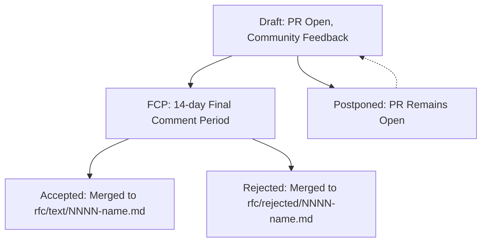

# RFC: Request For Comments (RFC) Process for TianoCore

## Metadata

- **RFC Number**: 0001
- **Title**: Request For Comments (RFC) Process for TianoCore
- **Status**: Accepted

## Change Log

- 2026-01-12: Initial RFC created proposing the RFC process for TianoCore.
- 2026-01-20: Add "partial" as a possible status reflected in directory structure.
- 2026-02-02: RFC accepted.

## Motivation

TianoCore project needs a formalized process for proposing, discussing, and deciding on substantial changes to the
EDK II codebase and related repositories. Currently, large feature proposals, architectural changes, and controversial
modifications are handled through a mix of GitHub pull requests, design meetings, and mailing list discussions without
a standardized workflow.

This RFC proposes adopting a Request For Comments (RFC) process to:

1. Provide a clear, documented path for proposing major changes
2. Ensure thorough community review and consensus building
3. Create a permanent record of design decisions and rationale
4. Distinguish between routine development and significant architectural decisions
5. Complement existing processes (Code First, Design Meetings) by supplementing them with written/tracked proposals

## Technology Background

RFCs are a well-established approach for software development communities to propose and document technical changes.

Notable examples include:

- **Rust Language**: Uses RFCs extensively for language and library evolution ([Rust RFC Process](https://github.com/rust-lang/rfcs))
- **Python Enhancement Proposals (PEPs)**: Similar process for Python language changes ([PEP 1 - PEP Purpose and Guidelines](https://peps.python.org/pep-0001/))
- **IETF RFCs**: Original RFC model for internet standards ([RFC Editor](https://www.rfc-editor.org/))

The TianoCore RFC process is largely inspired by the Rust RFC process but adapted for UEFI firmware development in C
and considering the unique aspects of:

- UEFI/PI specification compliance and the Code First Process
- Multi-repository project structure (edk2, edk2-platforms, etc.)
- Large established codebase with backward compatibility requirements
- The security-critical nature of firmware development
- Integration with existing TianoCore community processes

## Goals

1. **Formalize Major Change Proposals**: Establish a clear process for proposing substantial changes
2. **Build Community Consensus**: Provide structured review and discussion periods
3. **Document Decisions**: Create permanent, searchable record of design rationale
4. **Complement Existing Processes**: Integrate with Code First Process and Design Meetings
5. **Enable Asynchronous Participation**: Allow community members across time zones to participate
6. **Maintainer Flexibility**: Allow maintainers to require RFCs when appropriate
7. **Track All Outcomes**: Document accepted, rejected, and postponed proposals

## Requirements

1. This RFC process must provide clear guidelines for when RFCs are required vs optional
2. This RFC process must define roles and responsibilities (author, maintainers, reviewers)
3. This RFC process must specify the timeline for review and decision-making in the RFC lifecycle
4. This RFC process must document both accepted and rejected proposals
5. This RFC template must capture all necessary technical and contextual information for a given proposal
6. This RFC process must be accessible to all community members
7. This RFC process must support amendments to existing RFCs

## UEFI/PI Specification Impact

This RFC establishes a process and does not directly impact UEFI or PI specifications. However, the RFC process will
interact with the Code First Process for changes that do impact specifications.

**Relationship to Code First Process**:

- A Code First GitHub issue may require an RFC for complex changes
  - An RFC is not required for every Code First issue
- RFCs provide the design rationale
  - Code First PRs follow the normal Code First process while also referencing the RFC

## Backward Compatibility

This RFC introduces a new process without breaking existing workflows. All current contribution methods remain valid:

- Standard pull requests for bug fixes and general improvements
- Code First Process for specification changes
- Design Meeting presentations for early-stage ideas

The RFC process is additive and complements these existing mechanisms.

## Platform/Package Impact

This RFC applies to all TianoCore projects and packages. The RFC repository will be maintained in the
[`tianocore-wiki.github.io`](https://github.com/tianocore/tianocore-wiki.github.io) repository. RFC content is
organized under the `rfc/` directory structure.

### Directory Structure

- `rfc/template.md`: RFC template file
- `rfc/text/`: Accepted RFCs with sequential numbering
- `rfc/partial/`: Partially accepted RFCs with sequential numbering
- `rfc/rejected/`: Rejected RFCs with sequential numbering

RFCs may address changes to specific packages (e.g., `MdePkg`, `MdeModulePkg`) or larger architectural changes
affecting multiple packages.

In cases when an RFC is large in scope, but has agreement that can be reached on certain parts such that constructive
progress can be made based on those agreed-upon parts, the RFC may be marked as "partial" and moved to the
`rfc/partial/` directory upon merging. The RFC author should clearly indicate in the "Metadata" section of the RFC
which sections are accepted and which are still under discussion. In particular, the "Unresolved Questions" section
should clearly list the open items. In the future, a new RFC may be created to address the remaining opens. This is
doing by updating the same file in the `rfc/partial/` directory with a new PR that addresses the open items and
reflecting the changes in the "Change Log" section of the RFC. When the RFC is ready to be fully accepted, the PR
should move the file from `rfc/partial/` to `rfc/text/` retaining the same RFC number (and filename).

#### Partial Status Guidance

The "partial" status is intended to allow progress on complex proposals while still documenting open issues. It is
not meant to be a way to avoid consensus on major points. It should be clear that the agreed upon parts cohesively
fit into an agreed upon overall design. If the agreed upon parts are independent of a larger unifying design, consider
creating a new RFC for those parts instead.

The "partial" status is not intended to be a common outcome. It should be used judiciously to avoid fragmentation of
design discussions that fall under a single design umbrella. In most cases, RFCs should aim for full acceptance or
rejection and the RFC may stay open however long is necessary until consensus is reached.

## Unresolved Questions

None at this time. This initial RFC provides the foundation, and the process may be refined based on community
experience.

## Prior Art/Related Work

This RFC is also based on the [Patina RFC Process](https://github.com/OpenDevicePartnership/patina) which was inspired
by the Rust RFC process as well.

### Unique Adaptations for TianoCore

- Extended FCP period (14 days vs 7-10 days) since the community is more distributed
- Integration with existing TianoCore Code First Process and Design Meetings

### Existing TianoCore Processes for Reference

- [EDK II Code First Process](../../development/contribution-guides/edk_ii_code_first_process.md): For spec-impacting changes
- [Design Meeting](../../governance/meetings-minutes/design_meeting.md): For presenting early-stage ideas
- [EDK II Development Process](../../development/contribution-guides/edk_ii_development_process.md): Standard PR workflow

## Alternatives

### Alternative 1: Continue Ad-Hoc Approach

- Pro: No new process overhead
- Con: Inconsistent handling of major changes, lack of documentation, more difficult to understand how to propose
  a change and get community buy-in

### Alternative 2: Use Only Design Meetings

- Pro: Real-time discussion
- Con: Limited to meeting attendees, no permanent written record, timezone challenges

### Alternative 3: Use Only Code First Process

- Pro: Already established
- Con: Focused on spec changes only, not suitable for other relevant proposals

## Implementation Design

### The Complete RFC Process

1. **Determine if RFC is Needed**: The author evaluates whether a change requires an RFC (see examples below)
2. **Create Branch**: The author creates a feature branch in their tianocore-wiki fork
3. **Copy Template**: The author copies `rfc/template.md` to `rfc/text/0000-feature-name.md`
4. **Write RFC**: The author fills out the template with proposal details
5. **Submit Pull Request**: The author creates a PR to the wiki repository
   - Note: Proposed GitHub automation will apply an "rfc" label to PRs targeting `rfc/` directory
     - The "`rfc`" label triggers an email notification to the [`rfc@edk2.groups.io`](https://edk2.groups.io/g/rfc/topics)
       mailing list with a link to the PR for community awareness
6. **Draft Stage**: The community reviews and provides feedback and the author iterates updating the revision history
   in the RFC
7. **Signal FCP**: The author updates PR title/description to indicate Final Comment Period (FCP) readiness
   - There should be no outstanding feedback when the RFC moves to FCP
8. **Final Comment Period (FCP)**: 14-day period for final objections
9. **Decision**:
   - **Accepted**: A wiki maintainer merges the PR, renaming file from `0000-name.md` to `NNNN-name.md` in `rfc/text/`
   - **Partially Accepted**: A wiki maintainer merges the PR, renaming file from `0000-name.md` to `NNNN-name.md` in
     `rfc/partial/`
   - **Rejected**: A wiki maintainer merges the PR, renaming file from `0000-name.md` to `NNNN-name.md` in
     `rfc/rejected/`
   - **Postponed**: PR remains open without merging; no RFC number assigned yet

### RFC Lifecycle Stages

**Stage Descriptions**:

- **Draft**: Initial state when PR is opened. Community provides feedback. Author iterates on RFC content.
- **Final Comment Period (FCP)**: 14-day period after rough consensus is reached. Final objections can be raised.
- **Accepted**: RFC merged to `rfc/text/` with sequential number. Proposal is approved for implementation.
- **Rejected**: RFC merged to `rfc/rejected/` with sequential number. Proposal is declined with documented rationale.
- **Postponed**: RFC kept as open PR. May be revisited later but not currently prioritized.
  - If a PR is expected to be postponed for an extended period, the author should note this in the PR description and
    close the PR. It can be reopened later when ready to continue or a new PR can be created referencing the old one.

### RFC Numbering

- Accepted and rejected RFCs share a single sequential numbering scheme
- RFC numbers are assigned at merge time by examining both `rfc/text/` and `rfc/rejected/` directories
- The first available number is used (e.g., if 0003 exists in text/ and 0004 in rejected/, the next RFC is assigned
  0005)

### Roles and Responsibilities

**RFC Author**:

- Writes the RFC using the template
- Responds to feedback and updates RFC during Draft stage
- Signals when ready for FCP by updating PR title/description
- Updates RFC status field in metadata

**Community Reviewers**:

- Provide constructive feedback on RFCs
- Raise concerns during the Draft and FCP stages
- Help build consensus

**Package Maintainers**:

- May require an RFC for any substantial change in their package domain
- Provide technical review of RFCs affecting their packages
- Any edk2 maintainer can reject an RFC PR with appropriate justification
  - If the author disagrees with the rejection, they may re-propose the RFC later after addressing concerns

**Wiki Repository Maintainers**:

- Merge accepted or rejected RFCs after FCP concludes
- Assign RFC numbers by checking next available number
- Rename files from `0000-name.md` to `NNNN-name.md`
- Move files to appropriate directory (`rfc/text/` or `rfc/rejected/`)
- Update RFC status metadata field

### When to Use RFC Process

**RFCs are required for**:

- The introduction of new packages
- Major new features
- Major changes to TianoCore processes that need agreement from multiple stakeholders
- Changes with substantial backward compatibility impact
- New security-sensitive features or cryptographic implementations
- Changes to core infrastructure (build system, CI/CD, testing frameworks)

**RFCs are recommended for**:

- Cross-package changes requiring coordination between multiple maintainers
- Introduction of new design patterns or coding conventions
- Performance-critical changes to hot paths

**RFCs are optional for**:

- Bug fixes (even complex ones)
- Performance optimizations
- Simple backward incompatible changes (integration instructions should be provided in their PR description)
- Test coverage additions
- Code cleanup and refactoring within established patterns

**Maintainer Discretion**:

- Package maintainers may request an RFC for any PR they deem substantial
- When in doubt, ask on the PR or mailing list whether an RFC is appropriate

---

As a rule of thumb, it should be obvious why an RFC is needed based on the scale and impact of the proposed change.
The goal is to avoid unnecessary overhead for routine contributions while ensuring major changes receive proper review
and documentation. If an author is unsure, they should seek guidance from package maintainers or the community.

### Amendments and Revisions

**Amending an Accepted RFC**:

1. Create new PR proposing changes to the existing RFC file
2. Update the "Change Log" section with amendment details
3. The PR undergoes standard review process (does not require full RFC FCP)
4. A wiki maintainer merges the amendment PR, updating the existing RFC file

**Superseding an RFC**:

1. Create new RFC that explicitly references the RFC being superseded
2. The new RFC must explain what has changed and why
3. The new RFC receives a new sequential number
4. The old RFC's status is updated to "Superseded by RFC NNNN"

### Rejected RFCs

Rejected RFCs are valuable documentation of decisions not to pursue certain directions. They:

- Receive sequential RFC numbers just like accepted RFCs
- Are stored in `rfc/rejected/` directory
- Must include a section explaining the rejection rationale

Rejected RFCs prevent future duplication of rejected proposals and can be referenced in discussions of similar ideas
in the future.

**Re-proposing Rejected Ideas**:

- A rejected RFC may be re-proposed in the future
- The new RFC must reference the original rejection
- The new RFC must explain what has changed (context, approach, requirements)

### Automated Workflow

**GitHub Label Automation**:

- Any PR targeting `rfc/` directory automatically receives a "`rfc`" label
  - The "`rfc`" label triggers a GitHub Action workflow thatsends an email notification to `rfc@edk2.groups.io`
    mailing list
- Community members interested in RFC notifications should subscribe to `rfc@edk2.groups.io`

### Finding RFCs

- Filter open and/or closed GitHub PRs by the "`rfc`" label
- Browse `rfc/text/` directory for accepted RFCs
- Browse `rfc/rejected/` directory for rejected RFCs

## Testing Strategy

This RFC establishes a process rather than code, so traditional testing does not apply. However, the process will be
validated through this RFC itself.

## Migration/Adoption Plan

1. **Phase 1 - Foundation (This RFC)**:

   - Establish the RFC process via this RFC
   - Create an RFC template and supporting documentation
   - Describe GitHub automation for the "`rfc`" label

2. **Phase 2 - Pilot**:
   - Encourage an initial set of pilot RFCs for in-flight and planned major changes
   - Gather feedback from pilot RFC authors
   - Refine process based on lessons learned (amend this RFC if needed)

3. **Phase 3 - Adoption**:
   - Announce RFC process on edk2-devel mailing list
   - Update contribution guides to reference RFC process
   - Maintainers begin requiring RFCs for qualifying changes

4. **Phase 4 - Refinement**:
   - Amend process as needed based on community experience
   - Consider additional tooling or workflow improvements

## Guide-Level Explanation

**For Contributors**:

When you have a substantial change to propose, start by asking: "Is this a bug fix, small improvement, or major
feature?" If it's major, you should write an RFC.

Think of an RFC like a design document that the whole community can review. The RFC should benefit the developer
by clarifying your thinking and getting early feedback and the community by documenting important decisions, getting
consensus on ideas without implementation distractions, and providing context for complex changes during the code
review portion of the contribution.

**For Reviewers**:

When reviewing an RFC, focus on:

- Is the motivation clear and compelling?
- Are alternatives considered? Is this the best approach?
- What are the impacts (backward compatibility, security, performance)?
- Are there unresolved questions?

Provide constructive feedback during the Draft stage. During FCP, try to focus on any final objections rather than
revisiting earlier feedback.

**For Maintainers**:

You can require an RFC for any PR you consider substantial. Use your judgment based on the change's scope and impact.

RFCs help you understand the design rationale before reviewing implementation PRs. They also create documentation that
can be referenced when future questions arise about why certain decisions were made.
