# RFC: EDK2 Crypto Architecture Reorganization

## Metadata

- **RFC Number**: 0002
- **Title**: EDK2 Crypto Architecture Reorganization
- **Status**: Draft

## Change Log

- 2025-12-15: Initial RFC posted at [edk2-crypto](https://github.com/tianocore/edk2-crypto/discussions/2)
- 2026-01-14: Conform to [RFC proposal](https://github.com/tianocore/tianocore-wiki.github.io/pull/5)

---

## Motivation

The current monolithic CryptoPkg architecture creates several challenges:

1. **Scattered History** - Crypto changes mixed with unrelated EDK2 commits makes security audits difficult
2. **Weak Boundaries** - Platforms can bypass BaseCryptLib.h and link directly to OpensslLib
3. **Slow Security Response** - OpenSSL/MbedTLS patches tied to EDK2 release cycles
4. **PQC Readiness** - Post-quantum cryptography migration requires architectural agility

Moving crypto providers to a separate `edk2-crypto` repository addresses these by:

- Creating focused git history for security audits
- Enforcing abstraction through physical separation
- Enabling independent security patch releases
- Supporting parallel PQC algorithm experimentation

---

## Technology Background

### BaseCryptLib

EDK2's cryptographic abstraction layer (`BaseCryptLib.h`) provides ~300+ APIs for hashing, encryption, signatures,
TLS, and certificates. Platforms consume it through DSC library mappings.

### Current Crypto Providers

- **OpensslLib** (`CryptoPkg/Library/OpensslLib/`) - OpenSSL wrapper with UEFI build integration
- **MbedTlsLib** (`CryptoPkg/Library/MbedTlsLib/`) - Smaller footprint alternative

---

## Goals

1. **Enable Independent Security Response** - Decouple crypto releases from EDK2 cycles
2. **Establish Clear Architectural Boundaries** - All crypto usage through BaseCryptLib.h
3. **Create Focused Git History** - Dedicated repository for crypto changes
4. **Facilitate PQC Migration** - Support algorithm switching without code changes
5. **Support Focused Development** - Crypto experts work in crypto repos

---

## Requirements

- Platforms must be able to build with edk2-crypto as a submodule
- No C code changes required for migration (DSC/submodule only)
- Both OpensslPkg and MbedTlsPkg must implement BaseCryptLib.h

## UEFI/PI Specification Impact

None. This is an EDK2 reorganization, not a specification change.

## Backward Compatibility

Requires DSC remapping and git submodule setup. No API changes.

## Platform/Package Impact

Platforms include edk2-crypto as a submodule to:

- Pin specific versions for reproducible builds
- Update crypto independently of EDK2 releases
- Choose providers through DSC mappings

## Unresolved Questions

### Security Update Process

How should critical updates be coordinated between edk2-crypto and platforms?

**Action:** Requires separate RFC on security process.

### Versioning Strategy

Should edk2-crypto use semantic versioning independent of EDK2?

**Recommendation:** Use semantic versioning (SemVer) independent of EDK2 release cycles:

- **MAJOR** - Breaking changes to BaseCryptLib.h interface (requires platform code updates)
- **MINOR** - New cryptographic algorithms or non-breaking interface additions (backward compatible)
- **PATCH** - Security fixes, bug fixes, upstream OpenSSL/MbedTLS updates (no interface changes)

---

## Prior Art/Related Work

### Current Architecture

```mermaid
graph TB
     subgraph "Current EDK2 Crypto Layout"
      subgraph EDK2_Repo["EDK2 Repository"]
          CryptoPkg[CryptoPkg]

          %% Interface Layer
          subgraph InterfaceLayer["Public Interface"]
            direction TB
            BaseCryptLibH[BaseCryptLib.h]
            HashApiLibH[HashApiLib.h]
            TlsLibH[TlsLib.h]
          end

          subgraph DriverLayer["Driver Layer"]
            direction TB
            CryptoPei[CryptoPei]
            CryptoDxe[CryptoDxe]
            CryptoSmm[CryptoSmm]
            CryptoStandaloneMm[CryptoStandaloneMm]
          end

          subgraph LibraryLayer["Library Layer"]
            direction TB
            BaseCryptLib[BaseCryptLib]
            PeiCryptLib[PeiCryptLib]
            SmmCryptLib[SmmCryptLib]
            StandaloneCryptLib[StandaloneCryptLib]
          end

          subgraph LibraryLayerStatic["Implementation Layer"]
            direction TB
            BaseCryptLibOpenssl[BaseCryptLib OpenSSL]
            BaseCryptLibMbed[BaseCryptLibMbedTls]
            BaseCryptLibNull
            OpensslLib
            MbedTlsLib
            IntrinsicLib
            openssl
            mbedtls

          end

          CryptoPkg -.-> BaseCryptLibH
          CryptoPkg -.-> HashApiLibH
          CryptoPkg -.-> TlsLibH

          HashApiLibH -.-> BaseCryptLibH
          TlsLibH -.-> BaseCryptLibH


          %% BaseCryptLibH is backed by a library instance
          BaseCryptLibH --> BaseCryptLib
          BaseCryptLibH --> PeiCryptLib
          BaseCryptLibH --> SmmCryptLib
          BaseCryptLibH --> StandaloneCryptLib

          %% Library Instances are backed by either Static, Dynamic or NULL implementations
          %% PEI
          PeiCryptLib -.-> | by protocol | CryptoPei
          PeiCryptLib -.-> | static linking | BaseCryptLibOpenssl
          PeiCryptLib -.-> | static linking | BaseCryptLibMbed
          PeiCryptLib -.-> | static linking | BaseCryptLibNull
          %% DXE
          BaseCryptLib -.-> | by protocol | CryptoDxe
          BaseCryptLib -.-> | static linking | BaseCryptLibOpenssl
          BaseCryptLib -.-> | static linking | BaseCryptLibMbed
          BaseCryptLib -.-> | static linking | BaseCryptLibNull
          %% Smm
          SmmCryptLib -.-> | by protocol | CryptoSmm
          SmmCryptLib -.-> | static linking | BaseCryptLibOpenssl
          SmmCryptLib -.-> | static linking | BaseCryptLibMbed
          SmmCryptLib -.-> | static linking | BaseCryptLibNull
          %% Standalone
          StandaloneCryptLib -.-> | by protocol | CryptoStandaloneMm
          StandaloneCryptLib -.-> | static linking | BaseCryptLibOpenssl
          StandaloneCryptLib -.-> | static linking | BaseCryptLibMbed
          StandaloneCryptLib -.-> | static linking |BaseCryptLibNull

          %% Driver Linking
          %% PEI
          CryptoPei --> BaseCryptLibOpenssl
          CryptoPei --> BaseCryptLibMbed
          %% DXE
          CryptoDxe --> BaseCryptLibOpenssl
          CryptoDxe --> BaseCryptLibMbed
          %% SMM
          CryptoSmm --> BaseCryptLibOpenssl
          CryptoSmm --> BaseCryptLibMbed
          %% Standalone
          CryptoStandaloneMm --> BaseCryptLibOpenssl
          CryptoStandaloneMm --> BaseCryptLibMbed

          %% Library Backing
          BaseCryptLibOpenssl --> OpensslLib
          BaseCryptLibOpenssl --> IntrinsicLib
          BaseCryptLibMbed --> MbedTlsLib
          BaseCryptLibMbed --> IntrinsicLib

          OpensslLib --> openssl
          MbedTlsLib --> mbedtls

      end
    end

        style EDK2_Repo fill:#114B5F

        %% LibraryLayerStatic
        style LibraryLayerStatic fill:#2B5A78
        style LibraryLayer fill:#2B5A78
        style DriverLayer fill:#2B5A78
        style InterfaceLayer fill:#2B5A78

        %% Package
        style CryptoPkg fill:#95B3B9,color:#000000

        %% Interface
        style BaseCryptLibH fill:#BDD8CD,color:#000000
        style HashApiLibH fill:#BDD8CD,color:#000000
        style TlsLibH fill:#BDD8CD,color:#000000

        %% Libraries
        style BaseCryptLib fill:#E4FDE1,color:#000000
        style PeiCryptLib fill:#E4FDE1,color:#000000
        style SmmCryptLib fill:#E4FDE1,color:#000000
        style StandaloneCryptLib fill:#E4FDE1,color:#000000

        %% Drivers
        style CryptoPei fill:#ECACA5,color:#000000
        style CryptoDxe fill:#ECACA5,color:#000000
        style CryptoSmm fill:#ECACA5,color:#000000
        style CryptoStandaloneMm fill:#ECACA5,color:#000000

        %% Library backing
        style BaseCryptLibOpenssl fill:#F45B69,color:#FFFFFF
        style BaseCryptLibMbed fill:#F45B69,color:#FFFFFF
        style BaseCryptLibNull fill:#F45B69,color:#FFFFFF


        style MbedTlsLib fill:#F45B69,color:#FFFFFF
        style OpensslLib fill:#F45B69,color:#FFFFFF
        style IntrinsicLib fill:#F45B69,color:#FFFFFF
        style mbedtls fill:#F45B69,color:#FFFFFF
        style openssl fill:#F45B69,color:#FFFFFF
```



**Current Problems:**

1. Platforms can bypass BaseCryptLib.h and link directly to OpensslLib
2. Security patches require full EDK2 PR review and release cycles
3. Crypto changes mixed with unrelated commits
4. EDK2 CI validates crypto even when only platform code changes

---

## Alternatives

### Alternative 1: Keep Everything in EDK2

**Impact:** Maintains current workflow, no submodule complexity.

**Why not chosen:** Does not address core problems - security patches remain slow, history remains scattered, architectural
boundaries remain weak, crypto changes continue to impact EDK2 CI.

### Alternative 2: Move CryptoPkg Entirely to edk2-crypto

**Impact:** Even cleaner separation, EDK2 has zero crypto code.

**Why not chosen:** BaseCryptLib.h interface is part of EDK2's platform contract. Keeping the interface in EDK2 maintains
API stability while allowing implementation flexibility. This alternative may be considered in future iterations.

### Alternative 3: Create Separate Repos for OpensslPkg and MbedTlsPkg

**Impact:** Maximum separation, each crypto provider has its own release cycle.

**Why not chosen:** Adds significant coordination complexity. The edk2-crypto umbrella repository provides a middle
ground - focused crypto history while maintaining manageable dependency structure.

---

## Implementation Design

### What Stays in EDK2 (CryptoPkg)

- Interface definitions (BaseCryptLib.h, TlsLib.h, HashApiLib.h)
- Crypto drivers (CryptoPei, CryptoDxe, CryptoSmm, CryptoStandaloneMm)
- Null implementations (BaseCryptLibNull)

### What Moves to edk2-crypto

- **OpensslPkg** - OpenSSL-based BaseCryptLib + OpensslLib + IntrinsicLib
- **MbedTlsPkg** - MbedTLS-based BaseCryptLib + MbedTlsLib + IntrinsicLib

Each Crypto provider package would be responsible for implementing the BaseCryptLib contract
that remained in EDK2 CryptoPkg.

### Repository Structure

```txt
edk2-crypto/
├── OpensslPkg/
│   ├── Library/
│   │   ├── BaseCryptLib/
│   │   ├── OpensslLib/
│   │   └── IntrinsicLib/
│   ├── OpensslPkg.dec
│   └── OpensslPkg.dsc
└── MbedTlsPkg/
     ├── Library/
     │   ├── BaseCryptLib/
     │   ├── MbedTlsLib/
     │   └── IntrinsicLib/
     ├── MbedTlsPkg.dec
     └── MbedTlsPkg.dsc
```

### Proposed Architecture

```mermaid
graph TB
     subgraph "Proposed EDK2 Crypto Layout"
      subgraph EDK2_Repo["EDK2 Repository"]
          CryptoPkg[CryptoPkg]

          %% Interface Layer
          subgraph InterfaceLayer["Public Interface"]
            direction TB
            BaseCryptLibH[BaseCryptLib.h]
            HashApiLibH[HashApiLib.h]
            TlsLibH[TlsLib.h]
          end

          subgraph LibraryLayer["Library Layer"]
            direction TB
            BaseCryptLib[BaseCryptLib]
            PeiCryptLib[PeiCryptLib]
            SmmCryptLib[SmmCryptLib]
            StandaloneCryptLib[StandaloneCryptLib]
          end

          subgraph DriverLayer["Driver Layer"]
            direction TB
            CryptoPei[CryptoPei]
            CryptoDxe[CryptoDxe]
            CryptoSmm[CryptoSmm]
            CryptoStandaloneMm[CryptoStandaloneMm]
          end

          subgraph LibraryLayerStatic["Implementation Layer"]
            direction TB
            BaseCryptLibNull[BaseCryptLibNull]
          end
      end

      subgraph EDK2_Crypto_Repo["EDK2-Crypto Repository"]

          subgraph OpensslPkg["OpensslPkg"]
            direction TB
            BaseCryptLibOpenssl[BaseCryptLib]
            OpensslLib
            IntrinsicLibOpenssl[InstrinsicLib]
            openssl
          end

          subgraph MbedTlsPkg["MbedTlsPkg"]
            direction TB
            BaseCryptLibMbed[BaseCryptLib]
            MbedTlsLib
            IntrinsicLibMbed[InstrinsicLib]
            mbedtls
          end

          CryptoPkg -.-> BaseCryptLibH
          CryptoPkg -.-> HashApiLibH
          CryptoPkg -.-> TlsLibH

          HashApiLibH -.-> BaseCryptLibH
          TlsLibH -.-> BaseCryptLibH

          %% BaseCryptLibH is backed by a library instance
          BaseCryptLibH --> BaseCryptLib
          BaseCryptLibH --> PeiCryptLib
          BaseCryptLibH --> SmmCryptLib
          BaseCryptLibH --> StandaloneCryptLib

          %% Library Instances are backed by either Static, Dynamic or NULL implementations
          %% PEI
          PeiCryptLib -.-> | by protocol | CryptoPei
          PeiCryptLib -.-> | static linking | BaseCryptLibOpenssl
          PeiCryptLib -.-> | static linking | BaseCryptLibMbed
          PeiCryptLib -.-> | static linking | BaseCryptLibNull
          %% DXE
          BaseCryptLib -.-> | by protocol | CryptoDxe
          BaseCryptLib -.-> | static linking | BaseCryptLibOpenssl
          BaseCryptLib -.-> | static linking | BaseCryptLibMbed
          BaseCryptLib -.-> | static linking | BaseCryptLibNull
          %% Smm
          SmmCryptLib -.-> | by protocol | CryptoSmm
          SmmCryptLib -.-> | static linking | BaseCryptLibOpenssl
          SmmCryptLib -.-> | static linking | BaseCryptLibMbed
          SmmCryptLib -.-> | static linking | BaseCryptLibNull
          %% Standalone
          StandaloneCryptLib -.-> | by protocol | CryptoStandaloneMm
          StandaloneCryptLib -.-> | static linking | BaseCryptLibOpenssl
          StandaloneCryptLib -.-> | static linking | BaseCryptLibMbed
          StandaloneCryptLib -.-> | static linking |BaseCryptLibNull

          %% Driver Linking
          %% PEI
          CryptoPei --> BaseCryptLibOpenssl
          CryptoPei --> BaseCryptLibMbed
          %% DXE
          CryptoDxe --> BaseCryptLibOpenssl
          CryptoDxe --> BaseCryptLibMbed
          %% SMM
          CryptoSmm --> BaseCryptLibOpenssl
          CryptoSmm --> BaseCryptLibMbed
          %% Standalone
          CryptoStandaloneMm --> BaseCryptLibOpenssl
          CryptoStandaloneMm --> BaseCryptLibMbed

          %% Library Backing
          BaseCryptLibOpenssl --> OpensslLib
          BaseCryptLibOpenssl --> IntrinsicLibOpenssl
          BaseCryptLibMbed --> MbedTlsLib
          BaseCryptLibMbed --> IntrinsicLibMbed

          OpensslLib --> openssl
          MbedTlsLib --> mbedtls

      end
    end

        style EDK2_Repo fill:#114B5F
        style EDK2_Crypto_Repo fill:#783B49
        style MbedTlsPkg fill:#6B2737
        style OpensslPkg fill:#6B2737

        %% LibraryLayerStatic
        style LibraryLayerStatic fill:#2B5A78
        style LibraryLayer fill:#2B5A78
        style DriverLayer fill:#2B5A78
        style InterfaceLayer fill:#2B5A78

        %% Package
        style CryptoPkg fill:#95B3B9,color:#000000

        %% Interface
        style BaseCryptLibH fill:#BDD8CD,color:#000000
        style HashApiLibH fill:#BDD8CD,color:#000000
        style TlsLibH fill:#BDD8CD,color:#000000

        %% Libraries
        style BaseCryptLib fill:#E4FDE1,color:#000000
        style PeiCryptLib fill:#E4FDE1,color:#000000
        style SmmCryptLib fill:#E4FDE1,color:#000000
        style StandaloneCryptLib fill:#E4FDE1,color:#000000

        %% Drivers
        style CryptoPei fill:#ECACA5,color:#000000
        style CryptoDxe fill:#ECACA5,color:#000000
        style CryptoSmm fill:#ECACA5,color:#000000
        style CryptoStandaloneMm fill:#ECACA5,color:#000000

        %% Library backing
        style BaseCryptLibOpenssl fill:#F45B69,color:#FFFFFF
        style BaseCryptLibMbed fill:#F45B69,color:#FFFFFF
        style BaseCryptLibNull fill:#F45B69,color:#FFFFFF
        style MbedTlsLib fill:#F45B69,color:#FFFFFF
        style OpensslLib fill:#F45B69,color:#FFFFFF
        style IntrinsicLibOpenssl fill:#F45B69,color:#FFFFFF
        style IntrinsicLibMbed fill:#F45B69,color:#FFFFFF
        style mbedtls fill:#F45B69,color:#FFFFFF
        style openssl fill:#F45B69,color:#FFFFFF
```



### DSC Migration Example

```ini
# Before
[LibraryClasses]
  BaseCryptLib|CryptoPkg/Library/BaseCryptLib/BaseCryptLib.inf

# After (OpenSSL)
[LibraryClasses]
  BaseCryptLib|OpensslPkg/Library/BaseCryptLib/BaseCryptLib.inf

# Or (MbedTLS)
[LibraryClasses]
  BaseCryptLib|MbedTlsPkg/Library/BaseCryptLib/BaseCryptLib.inf
```

The after here is actually clearer where the BaseCryptLib implementation is coming from.

---

## Testing Strategy

### edk2-crypto CI

- Build OpensslPkg/MbedTlsPkg across architectures (IA32, X64, AARCH64, ARM) and toolchains
- Run BaseCryptLibUnitTest for interface compliance
- Verify provider parity where applicable

### Platform Integration

- OVMF as primary validation (Secure Boot, authenticated variables, TLS)
- Parallel builds during transition to verify equivalence

---

## Migration/Adoption Plan

### Phase 1: Initial Implementation (~1 month)

- Migrate OpensslLib/MbedTlsLib to OpensslPkg/MbedTlsPkg in edk2-crypto
- Establish CI pipelines

### Phase 2: EDK2 Integration (~2-3 months)

- Add edk2-crypto as submodule to EDK2
- Update OVMF as reference implementation
- Platform migration: add submodule, update PACKAGES_PATH, update DSC mappings

### Phase 3: Long-term Maintenance

- Independent release cycles with semantic versioning
- Coordinated security disclosure process

### Risk Mitigation

| Risk                                | Mitigation                              |
|-------------------------------------|-----------------------------------------|
| Interface changes during transition | Freeze BaseCryptLib.h during migration  |
| CI issues                           | Document manual build/test procedures   |
| Submodule complexity                | Provide setup scripts and documentation |

---

## Guide-Level Explanation

### For Package Developers

- No code changes required - BaseCryptLib.h unchanged and remains the contract
- Crypto changes happen in edk2-crypto, opaque to EDK2 mainline
  - This allows history to be easier to view and experiment with branches
- Cannot directly reference OpensslLib/MbedTlsLib from EDK2 packages without hurdles

### For Platform Developers

Migration steps:

1. Add submodule: `git submodule add https://github.com/tianocore/edk2-crypto.git`
2. Update PACKAGES_PATH to include edk2-crypto
3. Update DSC mappings to OpensslPkg or MbedTlsPkg
4. Verify builds and test

### For End Users

This reorganization is **transparent to end users** - firmware behavior remains identical:

- **No visible changes** - Boot experience, Secure Boot, and all crypto-dependent features work exactly as before
- **No new capabilities exposed** - This is an internal architecture change, not a feature addition
- **No required user actions** - Firmware updates from vendors will incorporate changes seamlessly
